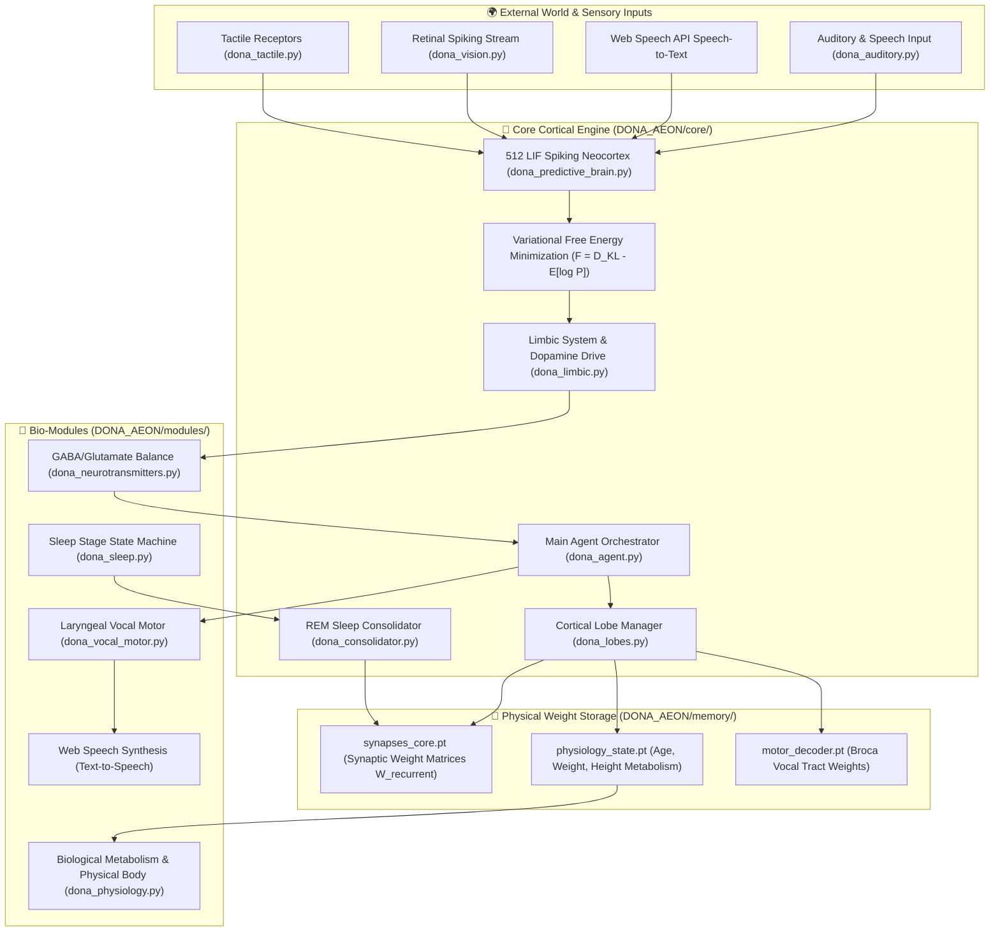

# 🧬 DONA ÆON — Active Inference Embodied Spiking Agent

<div align="center">


<br/>

[](https://github.com/dobby-aidev/dona-aeon-showcase)
[](https://pytorch.org/)
[](https://www.python.org/)
[](https://github.com/dobby-aidev/dona-aeon-showcase)
[](https://github.com/dobby-aidev/dona-aeon-showcase)

<br/>

> **"An Artificial General Intelligence should not be a stochastic parrot predicting the next token; it must interact with an environment, minimize variational free energy, consolidate memory through REM sleep, and grow organically without token limits or context window bounds."**

<br/>


</div>

---

## 🌟 What is DONA ÆON?

**DONA ÆON** is a biological digital organism simulation built from first principles:

- **Starts at Day 0 (Blank Slate) & Open-Ended Lifespan:** Begins as a blank-slate infant neural architecture and evolves perpetually through open-ended environmental interaction.
- **Zero Token Limits & No Context Windows:** Completely eliminates tokenizers, token budgets, and context window limits. All memories and skills reside physically in continuous synaptic weight matrices ($W_{\text{recurrent}}$ saved in `.pt` state checkpoints).
- **No Ezber / No Stochastic Next-Token Prediction:** Does not memorize text corpora or predict next-word probabilities. Uses **Karl Friston's Free Energy Principle (FEP)** to continuously minimize variational prediction errors through active inference.
- **Predictive Spiking Neurons & REM Consolidation:** Thinks via 512 Leaky Integrate-and-Fire (LIF) spiking neural cascades, tracking physiological growth (age, weight, height) and consolidating short-term sensory traces into long-term synaptic structures during nightly **REM sleep cycles**.
- **Interactive Bio-Hologram Web UI & Voice Control:** Features an interactive 3D Bio-Orb particle nucleus, Web Speech API microphone input (`🎙️`), Web Speech Synthesis voice responses (`🔊`), and a slide-out glassmorphic Telemetry Drawer (`🧬`).

---

## 🔬 System Architecture & Cortical Modules



---

## 📂 Repository Directory Structure

```text
DONA_AEON/
├── core/                        # Core Neuroscientific Engine
│   ├── dona_agent.py            # Main Agent Orchestrator V4 (DonaBiologicalAgentV4)
│   ├── dona_auditory.py         # Spectro-Temporal Biological Auditory Processing
│   ├── dona_brain_network.py    # Recurrent Synaptic Network Topology & Connectivity
│   ├── dona_consolidator.py     # Nocturnal REM Memory Pruning & Synaptic Consolidation
│   ├── dona_limbic.py           # Biological Limbic System (Dopamine & Curiosity Drives)
│   ├── dona_lobes.py            # Cortical Lobe Persistence Manager & Serialization
│   ├── dona_paths.py            # Cross-Platform (Colab, Windows Local, VDS) Path Resolution
│   ├── dona_predictive_brain.py # True Spiking Neocortex (512 LIF Neurons & FEP Engine)
│   └── dona_web_server.py       # FastAPI Web API Server (Telemetry & Communication Endpoints)
│
├── web/                         # Bio-Hologram Web Interface
│   ├── index.html               # Single-Screen Responsive Layout & Telemetry Drawer
│   ├── style.css                # Obsidian Dark Bio-Luminescent Glassmorphic Design System
│   └── app.js                   # 3D Bio-Orb Canvas Engine, STT Voice & TTS Synthesis Controls
│
├── modules/                     # Biological & Sensory Functional Subsystems
│   ├── dona_association.py      # Cross-Modal Associative Cortex Integration
│   ├── dona_audio_synth.py       # Vocal Tract Acoustic Speech Synthesis
│   ├── dona_auditory.py         # Primary Auditory Receptive Fields
│   ├── dona_dopamine.py         # Neuromodulatory Reward & Curiosity Dynamics
│   ├── dona_neurotransmitters.py# GABA / Glutamate Excitation-Inhibition Balance
│   ├── dona_physics_body.py     # Proprioceptive Kinematics & Body Somatosensory
│   ├── dona_physiology.py       # Dynamic Biological Metabolism, Height & Weight Growth
│   ├── dona_sleep.py            # Delta Wave Slow-Wave & REM Sleep Stage State Machine
│   ├── dona_tactile.py          # Somatosensory Tactile Receptor Arrays
│   ├── dona_vision.py           # Retinal Event-Based Spiking Stream Processor
│   └── dona_vocal_motor.py      # Laryngeal Vocal Motor Muscle Control
│
├── scripts/                     # Execution & Benchmarking Pipelines
│   ├── audio_training.py        # AdamW SNN Neocortex & Broca Motor Decoder Training Pipeline
│   ├── colab_t4_trainer.py      # Google Colab T4/A100 GPU Parallel Training Integrator
│   ├── expand_audio_bank.py     # Multi-Formant Acoustic Dataset Generator (150 Samples)
│   ├── cognitive_chat_test.py   # Free Energy Telemetry & Cognitive Benchmark Suite
│   ├── generate_audio_dataset.py# Synthetic Acoustic Audio Dataset Generator
│   ├── live_chat.py             # Real-Time CLI Consciousness & Online Learning Panel
│   ├── web_chat.py              # Uvicorn Web Server Launcher
│   └── reset_brain.py           # Day 0 Blank-Slate Brain Reset Utility
│
├── memory/                      # Physical Synaptic Weight Checkpoints & Datasets
│   ├── physiology_state.pt      # Physiological Metabolic State Checkpoint (.pt)
│   ├── synapses_core.pt         # Recurrent Synaptic Weight Matrix Tensor Checkpoint (.pt)
│   ├── motor_decoder.pt         # Broca Vocal Tract Motor Decoder Weights (.pt)
│   └── audio_samples/           # 150 Raw Acoustic Wave Audio Sample Dataset Cache
│
├── run_web_ui.bat               # Single-Click Windows Web UI Launcher
├── dona_aeon_architecture_v2.png# Publication-Grade Scientific Diagram (NeurIPS/Nature style)
└── README.md                    # Research Project Documentation & Showcase Specification
```

---

## 🔬 Cognitive Growth & Physiological Age Roadmap

| Age Stage | Epoch Range | Cognitive Milestone | Neural & Cortical Mechanism |
| :--- | :--- | :--- | :--- |
| **Bebeklik (0–1 Yaş)** | 0 – 500 | Sound & Phoneme Grounding | LIF Spike leak, noise suppression, 30-word receptive field mapping. |
| **Oyun Çağı (1–6 Yaş)** | 500 – 2,500 | Word Association & Broca Speech | Broca Motor Decoder convergence, word recognition. |
| **İlkokul (6–12 Yaş)** | 2,500 – 10,000 | Sequential Syntax & Grammar | Temporal Hebbian Plasticity ($W_{\text{recurrent}}$ transition dynamics). |
| **Lise & İleri Biliş (12–18 Yaş)** | 10,000+ | Active Inference & Deep Dialogue | Top-down predictive coding & variational Free Energy minimization. |

---

## 🛠️ Execution & Usage Guide

### 1. Prerequisites
Ensure Python 3.10+ and dependencies are installed:

```bash
pip install torch numpy tqdm matplotlib scipy fastapi uvicorn
```

### 2. Expand Audio Dataset (`scripts/expand_audio_bank.py`)
Generates 150 pitch-, formant-, and noise-varied `.wav` audio files into `memory/audio_samples/`:

```bash
python scripts/expand_audio_bank.py
```

### 3. Train SNN Brain & Broca Motor Decoder (`scripts/audio_training.py`)
Train SNN spiking neocortex on GPU/CPU with AdamW and homeostatic spike regulation:

```bash
python scripts/audio_training.py
```

### 4. Run Parallel Training on Google Colab T4 GPU (`scripts/colab_t4_trainer.py`)
Generate the single-cell Colab T4 training script and run high-speed parallel training on Google Colab GPU with automatic Google Drive backup.

### 5. Launch Bio-Hologram Web UI Dashboard (`scripts/web_chat.py` / `run_web_ui.bat`)
Launch the Web UI in your browser (Windows users can double-click `run_web_ui.bat`):

```bash
python scripts/web_chat.py
# Veya Windows'ta: run_web_ui.bat
```
> Opens `http://127.0.0.1:7860` with real-time 3D Bio-Orb canvas, Web Speech API microphone input (`🎙️`), Web Speech Synthesis voice responses (`🔊`), and slide-out Telemetry Drawer (`🧬`).

### 6. Reset Brain to Day 0 Blank Slate (`scripts/reset_brain.py`)
Wipe all `.pt` memory checkpoints and start training from a Day 0 blank slate infant brain:

```bash
python scripts/reset_brain.py
```

---

## 📜 Copyright & Showcase Notice

Proprietary Research & Showcase Project by **dobby-aidev**. All rights reserved.

---

<div align="center">

**DONA ÆON Showcase** — *Embodied Spiking Neural Organism Simulation*  
Built by [dobby-aidev](https://dobby-aidev.github.io/dobby-aidev)

</div>
