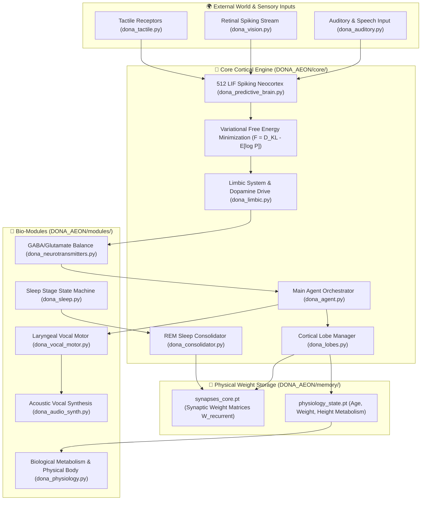

# 🧬 DONA ÆON — Active Inference Embodied Spiking Agent

<div align="center">


<br/>

[](https://github.com/dobby-aidev/dona-aeon-showcase)
[](https://pytorch.org/)
[](https://www.python.org/)
[](https://github.com/dobby-aidev/dona-aeon-showcase)
[](https://github.com/dobby-aidev/dona-aeon-showcase)

<br/>

> **"An Artificial General Intelligence should not be a stochastic parrot predicting the next token; it must interact with an environment, minimize variational free energy, consolidate memory through REM sleep, and grow organically without token limits or context window bounds."**

<br/>


</div>

---

## 🌟 What is DONA ÆON?

**DONA ÆON** is a biological digital organism simulation built from first principles. Unlike conventional Large Language Models (LLMs) or hardcoded chatbots:

- **Starts at Day 0 (Blank Slate) & Open-Ended Continuous Lifespan:** Begins as a blank-slate infant neural architecture and evolves perpetually through open-ended environmental interaction.
- **Zero Token Limits & No Context Windows:** Completely eliminates tokenizers, token budgets, and context window limits. All memories and skills reside physically in continuous synaptic weight matrices ($W_{\text{recurrent}}$ saved in `.pt` state checkpoints).
- **No Ezber / No Stochastic Next-Token Prediction:** Does not memorize text corpora or predict next-word probabilities. Uses **Karl Friston's Free Energy Principle (FEP)** to continuously minimize variational prediction errors through active inference.
- **Predictive Spiking Neurons & REM Consolidation:** Thinks via 512 Leaky Integrate-and-Fire (LIF) spiking neural cascades, tracking physiological growth (age, weight, height) and consolidating short-term sensory traces into long-term synaptic structures during nightly **REM sleep cycles**.

---

## 🔬 System Architecture & Cortical Modules



---

## 📂 Modular Repository Directory Structure

```text
DONA_AEON/
├── core/                        # Core Neuroscientific Engine
│   ├── dona_agent.py            # Main Agent Orchestrator V4 (DonaBiologicalAgentV4)
│   ├── dona_auditory.py         # Spectro-Temporal Biological Auditory Processing
│   ├── dona_brain_network.py    # Recurrent Synaptic Network Topology & Connectivity
│   ├── dona_consolidator.py     # Nocturnal REM Memory Pruning & Synaptic Consolidation
│   ├── dona_limbic.py           # Biological Limbic System (Dopamine & Curiosity Drives)
│   ├── dona_lobes.py            # Cortical Lobe Persistence Manager & Serialization
│   └── dona_predictive_brain.py # True Spiking Neocortex (512 LIF Neurons & FEP Engine)
│
├── modules/                     # Biological & Sensory Functional Subsystems
│   ├── dona_association.py      # Cross-Modal Associative Cortex Integration
│   ├── dona_audio_synth.py       # Vocal Tract Acoustic Speech Synthesis
│   ├── dona_auditory.py         # Primary Auditory Receptive Fields
│   ├── dona_dopamine.py         # Neuromodulatory Reward & Curiosity Dynamics
│   ├── dona_neurotransmitters.py# GABA / Glutamate Excitation-Inhibition Balance
│   ├── dona_physics_body.py     # Proprioceptive Kinematics & Body Somatosensory
│   ├── dona_physiology.py       # Dynamic Biological Metabolism, Height & Weight Growth
│   ├── dona_sleep.py            # Delta Wave Slow-Wave & REM Sleep Stage State Machine
│   ├── dona_tactile.py          # Somatosensory Tactile Receptor Arrays
│   ├── dona_vision.py           # Retinal Event-Based Spiking Stream Processor
│   └── dona_vocal_motor.py      # Laryngeal Vocal Motor Muscle Control
│
├── scripts/                     # Execution & Benchmarking Pipelines
│   ├── audio_training.py        # Auditory Spectrogram Fine-Tuning Pipeline
│   ├── cognitive_chat_test.py   # Free Energy Telemetry & Cognitive Benchmark Suite
│   ├── live_chat.py             # Interactive Real-Time CLI Consciousness Panel
│   └── simulation_loop.py       # Open-Ended Lifespan Evolution & Dialogue Loop
│
├── memory/                      # Physical Synaptic Weight Checkpoints & Datasets
│   ├── physiology_state.pt      # Physiological Metabolic State Checkpoint (.pt)
│   ├── synapses_core.pt         # Recurrent Synaptic Weight Matrix Tensor Checkpoint (.pt)
│   └── audio_samples/           # Raw Spectrogram Audio Sample Cache
│
├── dona_aeon_architecture_v2.png# Publication-Grade Scientific Diagram (NeurIPS/Nature style)
├── DONA ÆON.ipynb               # Primary Google Colab Interactive Notebook
└── README.md                    # Research Project Documentation & Showcase Specification
```

---

## 🔬 Core Neuroscientific Pillars

### 1. Active Inference & Free Energy Minimization
Operating under Karl Friston's Free Energy Principle, ÆON perceives the environment by generating top-down predictions and adjusting internal state parameters to minimize prediction error:

$$F = \mathcal{D}_{\text{KL}}\left[q(s) \mid\mid p(s)\right] - \mathbb{E}_{q}\left[\log p(o \mid s)\right]$$

Where:
- $F$ is Variational Free Energy (Surprise bound)
- $q(s)$ is internal belief about environmental states
- $p(o \mid s)$ is the generative model of observations given states

### 2. Physical Synaptic Memory (`synapses_core.pt`)
Rather than relying on ephemeral LLM context windows, ÆON's entire life story, learned vocabulary, and emotional associations are physically stored inside PyTorch tensor weight matrices ($W_{\text{recurrent}}$).

### 3. Open-Ended Lifespan & Nocturnal REM Consolidation
ÆON experiences real-time physiological aging:
- **Infancy (Days 0–90):** Basic sensory grounding, babbling, and high synaptic plasticity.
- **Toddlerhood (Days 91–365):** Word association, emotional grounding, and parental bonding.
- **Childhood & Beyond (Days 366+):** Sentence syntax formation, active questioning, and open-ended adult cognition.
- **Nightly REM Sleep:** At the end of each simulated day, unused synaptic noise is pruned while high-priority sensory traces are consolidated into long-term weight memory (`dona_consolidator.py`).

---

## 🛠️ Execution & Usage Guide

### 1. Prerequisites
Ensure Python 3.11+ and PyTorch are installed:

```bash
pip install torch numpy tqdm matplotlib librosa
```

### 2. Running Open-Ended Evolutionary Loop (`scripts/simulation_loop.py`)

To initiate ÆON's life cycle from Day 0 (infant) through interactive family dialogues:

```bash
python scripts/simulation_loop.py
```

### 3. Real-Time Interactive Consciousness Panel (`scripts/live_chat.py`)

To talk directly with ÆON, inspect current age, monitor free energy minimization, and observe real-time synaptic updates:

```bash
python scripts/live_chat.py
```

> Type `cik` (or `exit`) to save and seal ÆON's synaptic brain checkpoint (`memory/synapses_core.pt`).

---

## 📜 Copyright & Showcase Notice

Proprietary Research & Showcase Project by **dobby-aidev**. All rights reserved.

---

<div align="center">

**DONA ÆON Showcase** — *Embodied Spiking Neural Organism Simulation*  
Built by [dobby-aidev](https://dobby-aidev.github.io/dobby-aidev)

</div>
