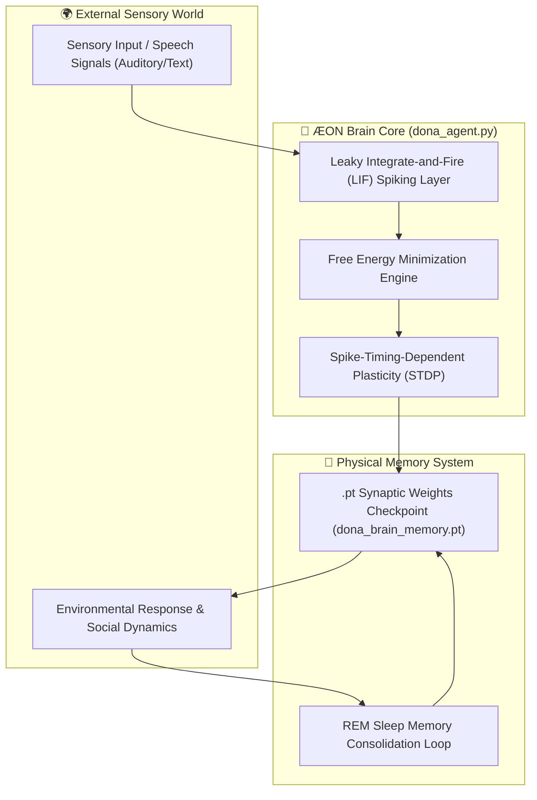

# 🧬 DONA ÆON — Active Inference Embodied Spiking Agent

<div align="center">


<br/>

[](LICENSE)
[](https://pytorch.org/)
[](https://www.python.org/)
[](https://github.com/dobby-aidev/dona-aeon-showcase)
[](https://github.com/dobby-aidev/dona-aeon-showcase)

<br/>

> **"A Artificial General Intelligence should not be a stochastic parrot predicting the next token; it must interact with an environment, minimize variational free energy, consolidate memory through REM sleep, and grow organically from infancy."**

</div>

---

## 🌟 What is DONA ÆON?

**DONA ÆON** is a biological digital organism simulation built from first principles. Unlike conventional Large Language Models (LLMs) or hardcoded chatbots:

- **Starts at Day 0 (Infant State):** Begins as a blank-slate neural architecture with zero prior linguistic bias.
- **Predictive Spiking Neurons:** Thinks through Leaky Integrate-and-Fire (LIF) spiking neural dynamics rather than static matrix multiplications.
- **Karl Friston's Free Energy Principle (FEP):** Driven continuously to minimize surprise (Variational Free Energy) between internal generative models and environmental sensory inputs.
- **Physical Synaptic Memory:** Stores memories directly inside physical synaptic connection weights ($W_{ij}$ saved in `.pt` state checkpoints), eliminating external context window constraints.
- **730-Day Developmental Lifecycle:** Organically grows over a 2-year simulation cycle—tracking physical age, weight, height, and consolidating short-term experiences into long-term synaptic structures during nightly **REM sleep cycles**.

---

## 🔬 Core Neuroscientific Pillars



### 1. Zero Hardcoded Prompts or Rules
There are no predefined `if-else` branching rules, static response templates, or system prompts. ÆON's behavior emerges purely from neural activation cascades.

### 2. Physical Synaptic Memory (`.pt`)
Rather than relying on ephemeral LLM context windows, ÆON's entire life story, learned vocabulary, and emotional associations are physically stored inside PyTorch tensor weight matrices ($W_{ij}$).

### 3. Active Inference & Free Energy Minimization
Operating under Karl Friston's Free Energy Principle, ÆON perceives the environment by generating top-down predictions and adjusting internal state parameters to minimize prediction error:

$$F = \mathcal{D}_{\text{KL}}\left[q(s) \mid\mid p(s)\right] - \mathbb{E}_{q}\left[\log p(o \mid s)\right]$$

Where:
- $F$ is Variational Free Energy (Surprise bound)
- $q(s)$ is internal belief about environmental states
- $p(o \mid s)$ is the generative model of observations given states

### 4. 730-Day Growth & Nocturnal REM Consolidation
ÆON experiences real-time physiological aging:
- **Infancy (Days 0–90):** Basic sensory grounding, babbling, and high synaptic plasticity.
- **Toddlerhood (Days 91–365):** Word association, emotional grounding, and parental bonding.
- **Childhood (Days 366–730):** Sentence syntax formation, active questioning, and complex problem-solving.
- **Nightly REM Sleep:** At the end of each simulated day, unused synaptic noise is pruned while high-priority sensory traces are consolidated into long-term weight memory.

---

## 📂 Project Architecture

```text
DONA_AEON/
├── dona_agent.py             # Core Neuroscientific SNN Engine & Active Inference Cortex
├── dona_brain_memory.pt      # Physical Synaptic Weight Matrices & Physiological Life State (.pt)
├── simulation_loop.py        # 730-Day Growth Lifecycle, Parent/Teacher Interaction Engine
└── live_chat.py              # Interactive Real-Time CLI Consciousness Panel
```

### Component Breakdown

| File | Purpose | Key Responsibilities |
|:---|:---|:---|
| **`dona_agent.py`** | Brain Engine | Implements spiking neural dynamics, LIF activation, prediction error computation, and STDP weight updates. |
| **`dona_brain_memory.pt`** | Neural Checkpoint | Stores synaptic connectivity matrix ($W$), age in days, physiological stats (height/weight), and experience counts. |
| **`simulation_loop.py`** | Growth Environment | Simulates a 2-year lifespan (730 days) with parent/teacher dialogues, feeding sensory inputs to ÆON. |
| **`live_chat.py`** | Interface | Allows direct real-time interaction with ÆON, displaying current age, free energy metrics, and synaptic responses. |

---

## 🛠️ Quickstart & Setup Guide

### 1. Prerequisites
Ensure you have Python 3.11+ and PyTorch installed:

```bash
pip install torch numpy tqdm
```

### 2. Environment Setup (Google Colab / Local)

If running in Google Colab, mount Google Drive:

```python
from google.colab import drive
drive.mount('/content/drive')
```

Ensure the repository root contains `dona_agent.py`.

### 3. Running the 730-Day Growth Lifecycle (`simulation_loop.py`)

To initiate ÆON's life cycle from Day 0 (infant) through interactive family dialogues:

```bash
python simulation_loop.py
```

> 💡 **Fresh Birth:** To start a completely new infant organism from scratch, delete the `dona_brain_memory.pt` file before running the script.

### 4. Interactive Live Consciousness Panel (`live_chat.py`)

To talk directly with ÆON, inspect current age, monitor free energy minimization, and observe real-time synaptic updates:

```bash
python live_chat.py
```

> Type `cik` (or `exit`) to save and seal ÆON's synaptic brain checkpoint before exiting.

---

## 🔬 Research Philosophy

> *"True Artificial General Intelligence cannot be achieved merely by scaling up auto-regressive next-token prediction over text corpora. A cognitive agent must be embodied, interact with a dynamic environment, learn via synaptic plasticity, sleep to prevent catastrophic forgetting, and evolve through variational error minimization."*

---

## 🗺️ Roadmap & Future Horizons

- [x] **Phase 1 — Infancy & Spiking Foundations:** LIF spiking neural engine, Free Energy minimization, 730-day lifecycle simulation.
- [x] **Phase 2 — Synaptic Persistence:** `.pt` weight memory saving, nightly REM sleep consolidation loop.
- [ ] **Phase 3 — Multi-Sensory Embodiment:** Direct visual (spiking camera feed) and spatial auditory sensory inputs.
- [ ] **Phase 4 — Hippocampal Grid Cells:** Spatial navigation and internal mental map generation via entorhinal grid cell networks.

---

## 📜 License

Distributed under the **MIT License**. See [`LICENSE`](LICENSE) for more information.

---

<div align="center">

**DONA ÆON Showcase** — *Embodied Spiking Neural Organism Simulation*  
Built by [dobby-aidev](https://dobby-aidev.github.io/dobby-aidev)

</div>
