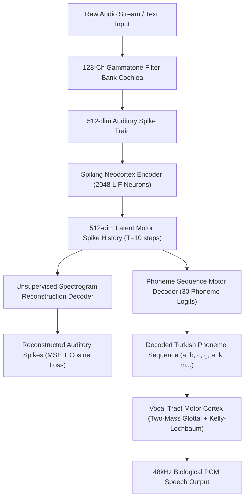

# 🧠 DONA ÆON — Neuromorphic Digital Mind (NDM)

 

[-6366F1?style=for-the-badge)](https://github.com/dobby-aidev/dona-aeon-showcase)

 

> **"True Artificial General Intelligence is not a stochastic LLM predicting text tokens; it is a Neuromorphic Digital Mind (NDM) that perceives raw biological auditory frequency spectra, minimizes variational free energy, and speaks through physical acoustic motor articulation."**

 

---

## 🌟 What is DONA ÆON?

**DONA ÆON** is an **Autonomous Neuromorphic Digital Mind (NDM)** built from first principles. Unlike conventional Large Language Models (LLMs) or hardcoded chatbots, ÆON operates as a virtual biological neocortex:

- **Zero LLM / External API Dependency:** Operates 100% locally via event-driven Spiking Neural Networks (SNN).
- **128-Channel ERB Gammatone Auditory Cochlea:** Perceives raw sound waves through a 128-channel logarithmic ERB-scale Gammatone filter bank ($20\text{Hz} - 20.000\text{Hz}$), converting audio into biological frequency spike trains ($512$-dim).
- **Unsupervised Acoustic Spectrogram Reconstruction:** Features an unsupervised $512$-dim predictive coding auto-encoder that learns continuous acoustic representations directly from raw human speech without forced discrete word labels.
- **Temporal Phoneme Sequence Decoder:** Decodes temporal spike history ($T$ frames) into 30 Turkish phoneme classes ($29$ Turkish letters + `<SIL>`), enabling open-ended phoneme combination and speech formation.
- **Biomimetic Vocal Motor Synthesis:** Synthesizes 48kHz physical PCM speech output via Two-Mass Glottal Vocal Cord dynamics and a 16-section Kelly-Lochbaum Acoustic Tube Filter.
- **Karl Friston's Free Energy Principle (FEP):** Continuously minimizes variational free energy (surprise bound) between internal generative models and environmental auditory observations.
- **Live Biological Telemetry:** Tracks ATP (Cellular Energy) consumption, Dopamine (Synaptic Plasticity), and intrinsic metabolic homeostasis.

---

## 🌌 Live Web Interface & Bio-Digital HUD

DONA ÆON features a live WebGL-powered biological containment HUD (`dona_web_server.py`) serving real-time SNN telemetry, Free Energy graphs, Dopamine levels, and an interactive Bio-Orb reactor.

  

---

## 🔬 Core Neuroscientific Pillars

### 1. Neuromorphic Digital Mind (NDM) Pipeline

### 2. Active Inference & Free Energy Minimization
Operating under Karl Friston's Free Energy Principle, ÆON perceives the environment by generating top-down predictions and adjusting internal state parameters to minimize prediction error:

$$F = \mathcal{D}_{\text{KL}}\left[q(s) \mid\mid p(s)\right] - \mathbb{E}_{q}\left[\log p(o \mid s)\right]$$

Where:
- $F$ is Variational Free Energy (Surprise bound)
- $q(s)$ is internal belief about environmental states
- $p(o \mid s)$ is the generative model of observations given states

### 3. Biological Telemetry & Neurochemistry
- **ATP (Energy):** Depletes during heavy auditory processing and active articulation; regenerates during rest phases.
- **Dopamine (DPM):** Spikes upon successful prediction of incoming sensory formants, dynamically scaling the Spike-Timing-Dependent Plasticity (STDP) rate.

---

## 📂 System Code Structure

DONA ÆON's NDM architecture is distributed across specialized neural modules mimicking human brain anatomy.

### 🧠 Core Neural Engine (`/core`)
| Module | Neuroscientific Function | Key Responsibilities |
|:---|:---|:---|
| **`snn_phoneme_autoencoder.py`** | **NDM Core Auto-Encoder** | Spiking Neocortex Encoder, Unsupervised Spectrogram Reconstruction Decoder, and Temporal Phoneme Sequence Decoder. |
| **`dona_brain_network.py`** | **Multi-Region SNN Topology** | Manages Neocortex ($512 \times 512$) and Hippocampus ($512 \times 512$) recurrent spiking networks. |
| **`conductance_neuron.py`** | **Conductance LIF Neurons** | Conductance-based Leaky Integrate-and-Fire (LIF) spiking neurons with surrogate fast-sigmoid gradients. |
| **`free_energy_core.py`** | **Active Inference Engine** | Calculates $F$ (Variational Free Energy) and surprise bounds. |
| **`dona_agent.py`** | **Organism Core** | Tracks physiological age, metabolic life cycle, and module firing. |
| **`autonomous_loop.py`** | **Intrinsic Volition** | Drives 7/24 idle metabolic loop and spontaneous predictive firing. |
| **`consolidation_manager.py`**| **REM Sleep System** | Prunes noisy synaptic weights and seals Neocortex and Phoneme Decoder states into `synapses_core.pt` and `motor_decoder.pt`. |

### 🧬 Sensory & Motor Modules (`/modules`)
| Module | Neuroscientific Function | Key Responsibilities |
|:---|:---|:---|
| **`neural_cochlea.py`** | **Gammatone Bio-Cochlea** | 128-channel ERB-scale Gammatone Filter Bank ($20\text{Hz} - 20.000\text{Hz}$) converting sound into 512-d auditory spikes. |
| **`dona_vocal_motor.py`** | **Broca's Vocal Motor** | Translates decoded temporal phoneme sequences into physical 48kHz PCM waveforms via Two-Mass Glottal Model and Kelly-Lochbaum filter. |
| **`two_mass_glottal_model.py`**| **Vocal Cord Dynamics** | Physical simulation of upper and lower vocal cord masses under lung pressure ($P_s$) and fundamental frequency ($F_0$). |
| **`kelly_lochbaum_tract.py`**| **Acoustic Tube Filter** | 16-section acoustic waveguide simulating human oral and pharyngeal cavity resonances for 29 Turkish phonemes. |

### 🛠️ Core Scripts & Tools (`/scripts`)
| Script | Utility Function | Key Responsibilities |
|:---|:---|:---|
| **`live_chat.py`** | **CLI NDM Panel** | Interactive NDM command-line session to converse, monitor free energy, and trigger physical vocal motor synthesis. |
| **`audio_training.py`** | **GPU SNN Training** | Runs GPU-accelerated Unsupervised Spectrogram Reconstruction and Temporal Phoneme Auto-Encoder training. |
| **`colab_t4_trainer.py`** | **Google Colab Engine** | One-click Colab T4/L4/A100 GPU integration script for non-stop synaptic sealing to Google Drive. |
| **`generate_harf_dataset.py`**| **Formant Synthesis** | Generates bio-acoustic frequency formant dataset for Turkish phonemes ($F_0, F_1, F_2, F_3$). |
| **`reset_brain.py`** | **Neural Wiping** | Resets physical `.pt` memory checkpoints to clean genomic baseline (Day 0). |

---

## 🗺️ Roadmap & Milestones

- [x] **Phase 1 — Spiking Foundations:** LIF spiking neural engine, conductance-based neurons, Free Energy minimization.
- [x] **Phase 2 — Gammatone Bio-Cochlea:** 128-channel ERB Gammatone filter bank auditory receptor ($20\text{Hz} - 20.000\text{Hz}$).
- [x] **Phase 3 — Unsupervised Reconstruction:** $512$-dim predictive coding spectrogram reconstructor and temporal phoneme sequence decoder.
- [x] **Phase 4 — Physical Vocal Synthesis:** Two-Mass Glottal Model and Kelly-Lochbaum Acoustic Tube 48kHz physical PCM voice synthesizer.
- [ ] **Phase 5 — Multi-Sensory Spike Integration:** Event-based DVS retina visual spike integration.

---

  <i>DONA ÆON — Neuromorphic Digital Mind (NDM) Architecture Showcase</i> 
  Built by <b>Dobby B</b>

