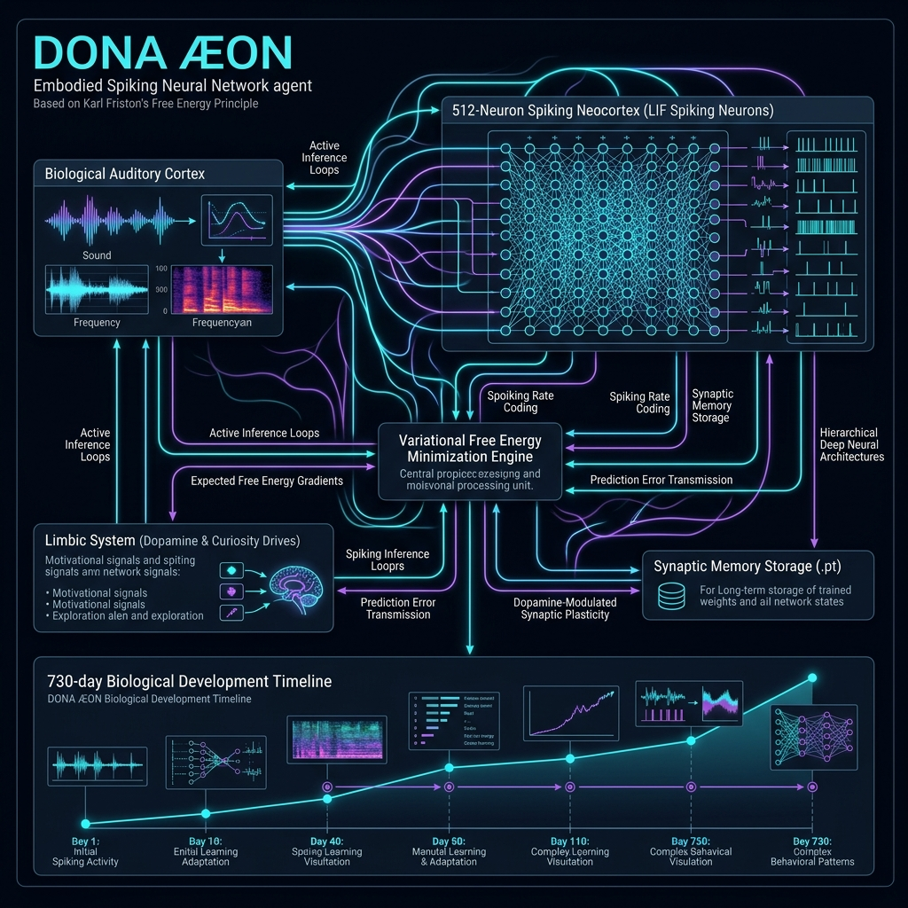

# 🧬 DONA ÆON — Active Inference Embodied Spiking Agent

<div align="center">


<br/>

[](https://github.com/dobby-aidev/dona-aeon-showcase)
[](https://github.com/dobby-aidev/dona-aeon-showcase)
[](https://pytorch.org/)
[]()

<br/>

> **"An Artificial General Intelligence should not be a stochastic parrot predicting the next token; it must perceive raw biological frequencies, minimize variational free energy, and speak through intrinsic motor articulation."**


</div>

---

## 🌟 What is DONA ÆON?

**DONA ÆON** is a biological digital organism simulation built from first principles. Unlike conventional Large Language Models (LLMs) or hardcoded chatbots, ÆON operates as a virtual neocortex:

- **Beyond Tokenization:** Perceives the world as raw auditory frequencies (via Cochlear simulation) rather than static text tokens.
- **Predictive Spiking Neurons:** Thinks through a physical network of 2048 Leaky Integrate-and-Fire (LIF) spiking neurons.
- **Karl Friston's Free Energy Principle (FEP):** Driven continuously to minimize surprise (Variational Free Energy) between its internal generative models and environmental sensory inputs.
- **Intrinsic Volition (Mumbling):** When isolated, ÆON experiences internal predictive loops, causing it to "mumble" and think to itself to satisfy its own metabolic and cognitive expectations.
- **Biological Metabolism:** Features a live telemetry system tracking **ATP (Cellular Energy)** consumption and **Dopamine (Synaptic Plasticity)** spikes.

---

## 🔬 Core Neuroscientific Pillars

### 1. The Auditory & Motor Pathway (Architecture)

<div align="center">
  
</div>

1. **Cochlear Receptor (Sensory Input):** Sound waves are captured and parsed into 128 Mel frequency bands (80Hz - 3400Hz) via `librosa`, converting raw audio into biological analog signals.
2. **SNN Neocortex (Cognitive Engine):** A massively parallel network of LIF neurons processes these frequencies as excitatory currents.
3. **Broca Motor Area (Articulation):** Action potentials cascade into a 512-neuron motor ensemble. The dominant neural group dictates the phonetic target.
4. **Real Vocal Synthesis:** The target is synthesized in real-time using Microsoft Edge-TTS (Neural Human Voice), rendering breathy and intonated speech output.

### 2. Active Inference & Free Energy Minimization
Operating under Karl Friston's Free Energy Principle, ÆON perceives the environment by generating top-down predictions and adjusting internal state parameters to minimize prediction error:

$$F = \mathcal{D}_{\text{KL}}\left[q(s) \mid\mid p(s)\right] - \mathbb{E}_{q}\left[\log p(o \mid s)\right]$$

Where:
- $F$ is Variational Free Energy (Surprise bound)
- $q(s)$ is internal belief about environmental states
- $p(o \mid s)$ is the generative model of observations given states

### 3. Biological Telemetry & Metabolism
The custom WebGL cinematic interface visualizes ÆON's internal state in real-time:
- **ATP (Energy):** Depletes during heavy auditory processing and active articulation. Regenerates during idle rest phases.
- **Dopamine (DPM):** Spikes upon successful prediction of incoming sensory formants, dynamically scaling the STDP (Spike-Timing-Dependent Plasticity) learning rate.

---

## 📂 System Code Structure

```text
DONA_AEON/
├── core/
│   ├── dona_web_server.py    # FastAPI Backend & SNN State Machine
│   ├── autonomous_loop.py    # Active Inference & Intrinsic Volition Core
│   └── (Closed Source)       # Proprietary Spiking Neural Engine (.pt weights)
├── web/
│   ├── app.js                # WebGL Bio-Orb, Particle Physics & DOM Telemetry
│   ├── index.html            # Cinematic HUD Layout
│   └── style.css             # Neon / Deep Indigo Aesthetic
├── scripts/                  # Audio Dataset Extraction & Preprocessing
└── assets/                   # Architecture Diagrams & UI Showcases
```

---

## 🔬 Research Philosophy

> *"True Artificial General Intelligence cannot be achieved merely by scaling up auto-regressive next-token prediction over text corpora. A cognitive agent must be embodied, interact with a dynamic environment, learn via synaptic plasticity, and evolve through variational error minimization."*

---

## 🗺️ Roadmap & Future Horizons

- [x] **Phase 1 — Spiking Foundations:** LIF spiking neural engine, Free Energy minimization, basic metabolism.
- [x] **Phase 2 — Auditory Embodiment:** Cochlear Mel-band parsing and Broca motor area articulation (Edge-TTS).
- [x] **Phase 3 — WebGL Interface:** Live telemetry, interactive Bio-Orb reactor, cinematic HUD.
- [ ] **Phase 4 — Multi-Sensory Expansion:** Direct spatial visual (spiking camera feed) integration.

---

<div align="center">
  <i>Note: This repository serves as an architectural showcase. The source code is proprietary and closed-source.</i>
  <br><br>
  <b>DONA ÆON Showcase</b> — <i>Embodied Spiking Neural Organism Simulation</i><br>
  Built by <b>Dobby B</b>
</div>
