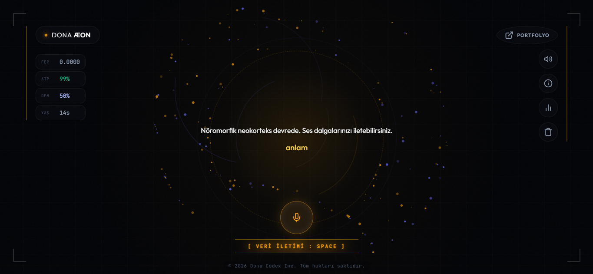

<div align="center">
  
  
  <br><br>

  <h1>DONA ÆON <br> <sub>Bio-Digital Autonomous Organism</sub></h1>

  <p>
    <b>Spiking Neural Networks (SNN)</b> and <b>Karl Friston's Free Energy Principle (FEP)</b> based, self-learning biological AI simulation.
  </p>

  <p>
    <a href="#architecture">Architecture</a> •
    <a href="#features">Features</a> •
    <a href="#installation">Installation</a> •
    <a href="#usage">Usage</a>
  </p>
</div>

---

## 🧬 Project Overview
Unlike traditional deep learning models (LLM, Transformer), DONA ÆON is a system that operates using the **Leaky Integrate-and-Fire (LIF)** dynamics of biological neurons. It processes words not as tokens, but as **auditory frequency (Cochlear Mel Band)** signals, and produces speech outputs (articulation) directly through the **Broca Motor Area**.

The system utilizes **Active Inference** and the **Free Energy Principle** mechanisms to make sense of its environment and minimize surprise. In short, ÆON is not a machine that reads text, but a virtual neocortex that hears sound and learns to speak from scratch, just like a baby.

## ✨ Key Features

- **State-of-the-Art Interface:** A modern and striking web UI featuring a dark cinematic theme, spinning bio-orb animations, live spectrum bars, and FEP (Free Energy) telemetry screens.
- **Real Human Voice Synthesis:** Instead of robotic TTS, it uses the Microsoft Azure Neural Edge-TTS infrastructure (tr-TR-EmelNeural / tr-TR-AhmetNeural) to produce a 100% natural, breathing, and intonated real human voice.
- **2048 LIF Neurons & 512 Broca Neurons:** Physical spike-based activation with a complete Spiking Neural Network (SNN) v4 architecture.
- **Cochlear Hearing Analysis:** A biological hearing simulation that divides incoming sound into 128 Mel bands and analyzes it across the 80Hz-3400Hz spectrum, converting it into neural inputs.
- **Live Telemetry & Autonomous Mumbling:** ATP (Energy) and Dopamine (Reward) metabolic cycles. When left alone, ÆON thinks to itself and mumbles in idle mode (Intrinsic Volition).
- **GPU Acceleration:** Ultra-fast neural evolution and training loop with NVIDIA CUDA / ROCm support and *Mini-Batch* optimization.

## 🏗️ Architecture


1. **Cochlear Receptor (Audio Input):** Sound received via Web Speech API or .wav file is converted into a spectrogram using Librosa.
2. **SNN Neocortex (Processing):** The Spiking Neural Network converts these frequencies into excitatory currents (LIF potentials).
3. **Broca Motor Output (Speech Production):** Potentials leaking from the neocortex trigger motor neurons in the Broca area to find the frequency target (word/syllable) with the highest potential.
4. **Real Voice (Audio Output):** The targeted word or mumble is converted into high-quality audio using Edge-TTS and played back through the web interface.

## 🚀 Installation

To run the system on your local machine or a cloud GPU server:

### Requirements
- Python 3.9 or higher
- Speaker and Microphone hardware

### Steps

1. **Clone the Repository**
   ```bash
   git clone https://github.com/dobby-b/dona-aeon.git
   cd dona-aeon
   ```

2. **Install Required Packages**
   ```bash
   pip install -r requirements.txt
   pip install edge-tts
   ```

3. **Start the Server**
   To start the system, load the SNN, and open the web server:
   ```bash
   python scripts/web_chat.py
   ```

4. **Open in Browser**
   Once the server is running, it will automatically open in your browser. If it doesn't, navigate to:
   `http://127.0.0.1:7860`

## 🎮 Usage Guide

- **Speaking (Spacebar):** Click the microphone in the center of the interface or press the **Space** key on your keyboard. Your speech will instantly be transmitted to the biological core.
- **Telemetry Panel:** By clicking the "Telemetry" button on the top right, you can watch ÆON's ATP, Dopamine, and FEP (Surprise/Free Energy) graphs live.
- **Recording Your Own Voice:** From the "Record Audio" menu, you can teach your own voice frequencies to ÆON's databank as a `.wav` file. The more ÆON listens to you, the better it will recognize your voice formants.

---
*Developer: Dobby B | DONA ÆON Project - Coded with the Free Energy Principle.*
