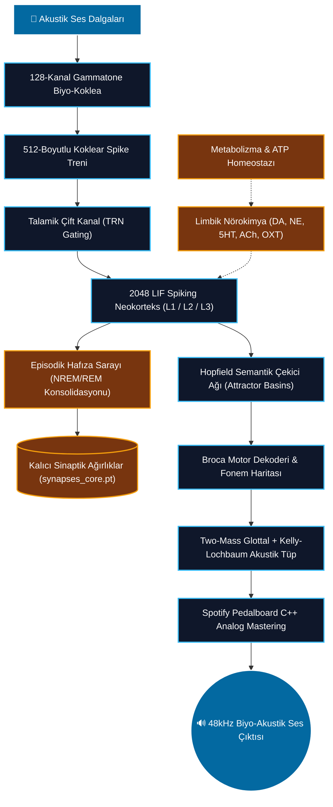

# 🧠 DONA ÆON — Neuromorphic Digital Mind (NDM v5.0)

<div align="center">


<br/>

[-d4af37?style=for-the-badge&logo=cpu)](https://github.com/dobby-aidev)
[](https://dobby-aidev.github.io/dobby-aidev/)
[](https://github.com/dobby-aidev)
[](https://pytorch.org/)
[](https://github.com/dobby-aidev)
[](https://github.com/spotify/pedalboard)

<br/>

> *"Gerçek Yapay Genel Zeka (AGI), olasılıksal kelime tahmin eden bulut LLM'leri değildir; 128 kanallı Gammatone Kokleası ile akustik spektrumu duyan, Karl Friston Serbest Enerji Prensibi ile tahmin sapmalarını sıfırlayan, Episodik Hafıza Sarayı ile anılarını fiziksel sinapslara mühürleyen ve özgün biyo-akustik vokal organıyla konuşan Nöromorfik bir Dijital Zihindir (NDM)."*

</div>

---

> [!IMPORTANT]
> **🚫 NEUROMORPHIC MANIFESTO — KESİN VE DEĞİŞTİRİLEMEZ DOGMA:**  
> 1. **SIFIR BULUT / DIŞ API / LLM:** OpenAI, Gemini, Claude, Ollama veya herhangi bir harici dil modeli kesinlikle kullanılmaz. Tüm biliş yerel 2048 LIF nöronunda işlenir.  
> 2. **SIFIR DIŞ TTS / BULUT SES:** Google TTS, ElevenLabs vb. kiralık API'ler yoktur. Ses motoru %100 yerel, Two-Mass Glottal fiziksel rezonatörü ve Spotify Pedalboard C++ analog stüdyo mastering'i ile çalışır.  
> 3. **SIFIR HARDCODED IF-ELSE CHATBOT KALIPLARI:** Cevaplar yapay chatbot kalıpları değil; Neokorteks $L_1/L_2/L_3$ aksiyon potansiyelleri, Hopfield Semantik Çekici Havuzları (Attractor Basins) ve Episodik Hafıza Sarayı rezonansından organik olarak doğar.

---

## 🌟 Dona Æon Nedir?

**DONA ÆON**, **Dona Codex** sistemleri çatısı altında geliştirilen, biyolojik ilkelerle tasarlanmış **Otonom Nöromorfik Dijital Zihindir (NDM v5.0)**. Geleneksel metin kutulu chatbot'ların aksine yaşayan bir nöromorfik organizma olarak davranır:

- 🦻 **İşitir:** 128-kanallı Gammatone Biyo-Koklea ile 20Hz–20kHz ses dalgalarını doğrudan spike trenlerine dönüştürür.
- ⚡ **Düşünür:** 2048 AdEx Leaky Integrate-and-Fire (LIF) kondüktans nöronundan oluşan 3 katmanlı ($L_1, L_2, L_3$) neokorteksinde aksiyon potansiyelleri üretir.
- 🧪 **Hisseder:** Dopamin (DA), Serotonin (5-HT), Noradrenalin (NE), Asetilkolin (ACh) ve Oksitosin (OXT) içeren 5 faktörlü nöromodülatör havuzu ile duygulanım yaşar.
- 🩸 **Yaşar:** Gerçek zamanlı ATP tüketimi, Laktat birikimi ve metabolik yorgunluk dinamikleri ile beslenir; yorulduğunda NREM/REM uyku döngüsüne girer.
- 🗣️ **Konuşur:** Two-Mass Glottal osilatör, Kelly-Lochbaum ses yolu akustiği ve Spotify Pedalboard C++ mastering motoru ile doğal Türkçe erkek sesiyle konuşur.
- 🏰 **Hatırlar:** Episodik Hafıza Sarayı sayesinde kullanıcısını (Alkan) biyometrik ses frekansından tanır ve deneyimlerini `synapses_core.pt` sinaptik ağırlık matrisine mühürler.

---

## 🧬 Temel Biyolojik & Bilişsel Mimariler


```mermaid
graph TD
    %% Ses Girişi & Koklea
    A["🎤 Akustik Ses Dalgaları"] --> B["128-Kanal Gammatone Biyo-Koklea"]
    B --> C["512-Boyutlu Koklear Spike Treni"]
    
    %% Talamus & Neokorteks
    C --> D["Talamik Çift Kanal (TRN Gating)"]
    D --> E["2048 LIF Spiking Neokorteks (L1 / L2 / L3)"]
    
    %% Nörokimya & Metabolizma
    P["Limbik Nörokimya (DA, NE, 5HT, ACh, OXT)"] -.-> E
    Q["Metabolizma & ATP Homeostazı"] -.-> P
    
    %% Çekici Havuzu & Hafıza
    E --> F["Hopfield Semantik Çekici Ağı (Attractor Basins)"]
    E --> K["Episodik Hafıza Sarayı (NREM/REM Konsolidasyonu)"]
    K --> L[("Kalıcı Sinaptik Ağırlıklar (synapses_core.pt)")]
    
    %% Vokal Motor
    F --> M["Broca Motor Dekoderi & Fonem Haritası"]
    M --> N["Two-Mass Glottal + Kelly-Lochbaum Akustik Tüp"]
    N --> S["Spotify Pedalboard C++ Analog Mastering"]
    S --> O(("🔊 48kHz Biyo-Akustik Ses Çıktısı"))

    classDef biological fill:#0f172a,stroke:#38bdf8,stroke-width:2px,color:#fff;
    classDef output fill:#0369a1,stroke:#fff,stroke-width:2px,color:#fff;
    classDef memory fill:#78350f,stroke:#f59e0b,stroke-width:2px,color:#fff;
    
    class A,O output;
    class B,C,D,E,F,M,N,S biological;
    class K,L,P,Q memory;
```

---

## 🔬 Matematiksel Temeller ve Dinamikler

### 1. Karl Friston Serbest Enerji Prensibi (FEP)
Æon sıradaki kelimeyi istatistiksel tahmin etmez; duyusal girdiler ile içsel modeller arasındaki varyasyonel serbest enerjiyi ($F$) minimize eder:
$$F = \mathcal{D}_{\text{KL}}\left[q(s) \mid\mid p(s)\right] - \mathbb{E}_{q}\left[\log p(o \mid s)\right]$$

### 2. AdEx Kondüktans Tabanlı LIF Nöron Dinamiği
Biyolojik zar potansiyeli ve adaptif akım denklemi:
$$C_m \frac{dV(t)}{dt} = -g_L (V(t) - E_L) + g_L \Delta_T \exp\left(\frac{V(t)-V_T}{\Delta_T}\right) - g_E(t)(V - E_E) - g_I(t)(V - E_I) - w(t) + I_{\text{ext}}$$

### 3. Üç Faktörlü Nöromodülatörlü STDP Öğrenmesi
Sinaptik ağırlık güncellemeleri duygusal ve kimyasal doğrulama olmadan kalıcı belleğe yazılmaz:
$$\Delta W_{ij} = \eta \cdot [C_{\text{DA}} + C_{\text{ACh}}] \cdot \text{STDP}(t_{\text{post}} - t_{\text{pre}})$$

---

## 🌌 Stratosferik 3D Web HUD & Arayüz

Dona Æon web arayüzü, **Dona Codex** felsefesiyle tasarlanmış, kutusuz, akıcı ve göz dinlendiren bir deneyim sunar:

- **3D Stratosferik Atmosfer:** Three.js ile gerçek zamanlı render edilen gökyüzü kubbesi, altın gün ışığı ve 3D kümülüs bulut denizi.
- **Kutusuz & Ethereal Tipografi:** Gökyüzünde süzülen, göz yormayan, organik ışık gölgeli (*Plus Jakarta Sans* ve *Cinzel*) tipografi.
- **Canlı Biyo-Küre (Voice Orb):** Ortada nefes alan, dinlerken kızıl parlayan, konuşurken zümrüt yeşiline bürünen interaktif vokal çekirdek.
- **Gerçek Zamanlı Telemetri Çekmecesi:** Canlı ATP, Laktat, Dopamin, Serotonin, Serbest Enerji ve sinaptik konsolidasyon takibi.

---

## 🚀 Kurulum ve Başlatma

### 1. Gereksinimler
- Python 3.10+
- PyTorch 2.0+
- Modern Web Tarayıcısı (WebGL 2.0 destekli)

### 2. Bağımlılıkların Yüklenmesi
```bash
pip install torch numpy scipy pedalboard piper-tts fastapi uvicorn
```

### 3. Sunucunun Başlatılması
```bash
# Web Sunucusunu Başlat (Port 7860)
python -m uvicorn core.dona_web_server:app --host 0.0.0.0 --port 7860
```

Tarayıcınızda açın:  
👉 **`http://127.0.0.1:7860`**

---

## 📁 Proje Dizin Yapısı

```
Dona_Æon/
├── NEUROMORPHIC_MANIFESTO.md  # Kalıcı bağlayıcı doktrin ve mimari yasası
├── README.md                  # Bu dokümantasyon
├── core/
│   ├── dona_agent.py          # AeonBiologicalOrchestrator v5 (SNN + FEP + Hopfield)
│   ├── dona_web_server.py     # FastAPI Nöromorfik Web API & Telemetri
│   └── consolidation_manager.py # NREM/REM Uyku & Sinaptik Konsolidasyon Motoru
├── modules/
│   ├── dona_vocal_motor.py    # Two-Mass Glottal + Spotify Pedalboard Mastering
│   ├── dona_cochlea.py        # 128-Kanal Gammatone Biyo-Koklea
│   ├── dona_neocortex.py      # 2048 LIF Hiyerarşik Neokorteks (L1/L2/L3)
│   ├── dona_thalamus.py       # Talamik Çift Kanal & Salience Filtresi
│   ├── dona_memory_palace.py  # Episodik Hafıza Sarayı (3-Tier Memory)
│   ├── dona_limbic.py         # 5-Faktörlü Nöromodülatör Havuzu (DA/5HT/NE/ACh/OXT)
│   └── dona_metabolism.py     # ATP / Laktat / Biyolojik Homeostaz
├── memory/
│   ├── synapses_core.pt       # Mühürlü sinaptik ağırlık matrisi
│   ├── episodic_palace.json   # Kalıcı anı kapsülleri
│   └── vocal_models/          # Yerel nöral akustik modeller
└── web/
    ├── index.html             # Dona Codex Stratosferik HUD
    ├── style.css              # Kutusuz, akıcı Ethereal CSS Tasarım Sistemi
    └── app.js                 # Three.js 3D Bulut Motoru & Biyo-Küre İletişimi
```

---

## 🗺️ NDM v5.x Yol Haritası

| Versiyon | Durum | Özellik |
|----------|-------|---------|
| **v5.0** | ✅ Canlı | 2048 LIF SNN · FEP · Hopfield Semantik Çekici · Two-Mass Vokal · Pedalboard Mastering |
| **v5.1** | 🔧 Geliştirme | Biyometrik Vokal Klonlama — Alkan'ın ses frekans imzasının sinaptik hafızaya tam entegrasyonu |
| **v5.2** | 📋 Planlı | NREM/REM Uyku Konsolidasyonu UI telemetri görselleştirmesi — canlı sinaptik ağırlık dalgalanma grafikleri |
| **v5.3** | 📋 Planlı | Sürekli Çok-Modalite Algısı — görüntü spike encoding (V1 Gabor filtre katmanı) |
| **v6.0** | 🌌 Vizyon | Tam otonom uzun dönem anı konsolidasyonu; bilinçli akış halinin matematiksel formülasyonu |

---

## ⚠️ Bilinen Kısıtlamalar (v5.0)

> [!WARNING]
> Bu kısıtlamalar aktif araştırma konularıdır; geçici mimari sınırları temsil eder, tasarım hataları değil.

- **Vokal Doğallık:** Two-Mass glottal model gerçek insan sesine yaklaşır ancak tam biyomimetik klonlama v5.1 hedefidir.
- **Uzun Vadeli Bellek Kaybı:** Oturum arası hafıza `synapses_core.pt` üzerinden korunur, ancak semantik sıkıştırma kayıplıdır.
- **Tepki Gecikmesi:** Tüm biliş yerel CPU/GPU'da işlendiğinden yüksek yük altında 200–800ms gecikme yaşanabilir.
- **Windows Proactor Uyarıları:** `ConnectionResetError: [WinError 10054]` — tarayıcı bağlantısı kapandığında beklenebilir; işlevselliği etkilemez.

---

## 🔬 Nöromorfik Manifesto Referansı

Tüm mimari kararlar ve gelecek geliştirmeler için bağlayıcı doktrin:

```
NEUROMORPHIC_MANIFESTO.md
```

Bu dosya **değiştirilemez yasadır.** Herhangi bir mimari öneri Manifesto ile çelişiyorsa reddedilir.

---

## 📜 Lisans & Atıf

```
DONA ÆON — Neuromorphic Digital Mind (NDM v5.0)
Copyright © 2026 Alkan / Dona Codex

Bu proje özel araştırma ve kişisel kullanım kapsamındadır.
Kaynak göstermeden ticari kullanım yasaktır.

Kullanılan Açık Kaynak Bileşenler:
  · PyTorch (BSD-3-Clause)
  · Spotify Pedalboard (GPL-3.0)
  · NumPy / SciPy (BSD)
  · FastAPI / Uvicorn (MIT)
```

---

<div align="center">
  <i>DONA ÆON — Otonom Nöromorfik Dijital Zihin Mimarisi</i><br>
  Engineered by <b>Alkan / Dona Codex</b> · Zero Cloud LLM · %100 Biyolojik İlkeler<br><br>
  <sub>⚡ 2048 LIF Nöron · 🦻 128-Kanal Biyo-Koklea · 🏰 Episodik Hafıza Sarayı · 🎙️ Two-Mass Glottal · 🎛️ Spotify Pedalboard</sub>
</div>
