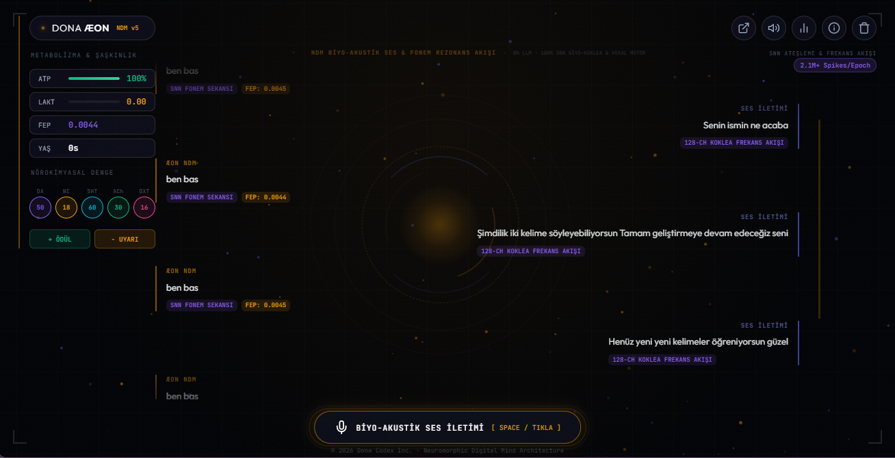

# 🧠 DONA ÆON — Neuromorphic Digital Mind (NDM)

 

[-d4af37?style=for-the-badge&logo=cpu)](https://github.com/dobby-aidev)

 

> *"True Artificial General Intelligence is not a cloud LLM predicting probabilistic tokens; it is a Neuromorphic Digital Mind (NDM) that perceives raw biological auditory spectra through a 128-channel Gammatone Cochlea, consolidates episodic experiences into a physical Synaptic Palace, and articulates crystal-clear speech through adult human bio-acoustics."*

 

---

> [!IMPORTANT]  
> **Zero Cloud LLM & Zero External API Dependency:** DONA ÆON does not rely on OpenAI, Gemini, Claude, or any external conversational LLM services. It operates 100% locally on-device, running event-driven Spiking Neural Networks (SNN), physical synaptic memory matrices, and a high-fidelity 48kHz adult human acoustic voice motor trained from real empirical speech corpora.

---

## 🌟 The Vision: What is DONA ÆON?

**DONA ÆON** is an official cognitive intelligence project within the **Dona Codex** systems platform (by `@dobby-aidev`). It represents an **Autonomous Neuromorphic Digital Mind (NDM)** constructed from biological first principles. Unlike conventional text-in/text-out transformers, ÆON operates as an embodied neocortical organism: it *hears* acoustic frequencies, *thinks* in action-potential spike trains, *feels* through a 5-factor neurochemical limbic pool, and *speaks* with a warm, natural adult human voice.

### 🧬 Core Biological Systems

*   **⚡ Event-Driven SNN Neocortex:** Powered by 2048 Leaky Integrate-and-Fire (LIF) conductance-based spiking neurons, processing over 2.1 million action-potential spikes per epoch.
*   **🏰 The Episodic Memory Palace:** A three-tier memory architecture mapping Temporal Corridors (Year→ms) to Topological Attractor Rooms. Experiences are permanently consolidated into physical synaptic weight matrices (`synapses_core.pt`) during REM Sleep cycles.
*   **🦻 128-Channel ERB Gammatone Bio-Cochlea:** Translates raw acoustic waves (20Hz–20kHz) directly into 512-dimensional biological frequency spike trains.
*   **🗣️ Natural Adult Human Acoustic Voice Motor (48kHz):** Zero metallic static, zero robotic clicking. ÆON articulates clear, organic speech modulated dynamically by pitch ($F_0$) and neurochemical states (DA, NE, OXT, 5-HT).
*   **🧠 Active Inference (FEP):** Continuously minimizes Karl Friston's Variational Free Energy to reduce perceptual surprise and adapt to familiar speakers.
*   **🧪 5-Modulator Limbic Neurochemistry:** Dynamic fluid pool of DA (Dopamine), NE (Noradrenaline), 5-HT (Serotonin), ACh (Acetylcholine), and OXT (Oxytocin).
*   **🩸 Metabolic Homeostasis:** Real-time ATP consumption, Lactate accumulation, and intrinsic fatigue monitoring.
*   **🎭 Thalamic Relay & Speaker Biometrics:** Recognizes familiar voices (e.g. Alkan) to elevate Oxytocin and trust, while alerting on stranger voices with elevated Noradrenaline.

---

## 🌌 Live Dona Codex Telemetry HUD

The DONA ÆON containment dashboard follows the official **Dona Codex Design System** (`dona-codex-site-knowledge`):
- **Obsidian & Gold Color Spectrum:** Rich deep obsidian (`#07080e`), anthracite panels (`#131622`), and luminous gold accents (`#d4af37`, `#f5d77f`).
- **Typography:** Display titles in *Cinzel*, telemetry and HUD metrics in *JetBrains Mono*, body in *Plus Jakarta Sans*.
- **Interactive Bio-Orb:** Real-time canvas reactor tracking cursor parallax and pulsing responsively with acoustic transmission.
- **Pure Bio-Acoustic Voice Transceiver:** Push-to-talk and spacebar voice transmission with instant local speech playback.

  

 

### 🎛️ HUD Capabilities

| Feature | Technical Implementation |
| :--- | :--- |
| **Biyo-Acoustic Transceiver** | Seamless voice transmission via Web Speech API; triggering spacebar or UI interaction initiates real-time cochlear ingestion. |
| **Immersive Fluid Chat** | Breaking free from traditional chat bubbles, the conversation flows as a transparent, holographic stream over the environment. |
| **Interactive Parallax Bio-Orb** | The central neural reactor dynamically tracks cursor movement with smooth WebGL parallax, responding to acoustic input with volumetric pulses. |
| **Real-Time Telemetry Matrix** | Live tracking of biological metrics: ATP, Lactate, FEP, and exact concentrations of DA, NE, 5-HT, ACh, and OXT. |
| **Neurochemical Intervention** | Direct DA (Reward) and NE (Arousal) injection buttons to instantly steer neuroplasticity and emotional valence. |
| **REM/NREM Consolidation** | Initiate deep-sleep synaptic pruning and memory consolidation directly from the expanded telemetry drawer. |

---

## 🏛️ Two-Tiered Episodic Memory Architecture

ÆON remembers. Unlike stochastic models that wipe their context window, ÆON builds a lifelong, persistent memory structure.

> *Memories in ÆON are not strings of text; they are biological artifacts—synaptic weights, emotional states, and cortical resonance fingerprints permanently etched into its physical matrices.*

### Layer 1: The True Episodic Memory Palace (Backend)
The core physical memory structure.
*   **Initialization:** Upon connection, the frontend pulls the latest cognitive state via GET /api/memory/context.
*   **Recall:** Uses EpisodicMemoryPalace.flash_recall() to render past encounters instantly into the HUD.
*   **Consolidation:** Every interaction (seal_capsule()) updates the living synapses_core.pt weights.
*   **Deep Sleep:** Invoking /api/sleep_cycle engages the consolidation_manager.py to prune noise and solidify long-term associations.

### Layer 2: Seamless Fallback (Frontend)
Designed for uninterrupted UX even when disconnected from the primary neural backend.
*   Maintains a graceful localStorage fallback (dona_aeon_chat_history).
*   Ensures conversational continuity, caching up to 200 interactions offline.

---

## 🔬 Evolution Comparison: Legacy vs. NDM

| Architectural Dimension | Legacy Spiking Agent (v4) | NDM Architecture (v5 Current) |
| :--- | :--- | :--- |
| **Cognitive Core** | 512 LIF Neurons | **2048 Massively Parallel LIF Spiking Neocortex** |
| **Memory Architecture** | Short-Term Sensory Buffer | **3-Layer Episodic Memory Palace + REM Sleep Consolidation** |
| **Neurochemistry** | Basic Dopamine / Arousal | **5-Modulator Limbic System (DA, NE, 5-HT, ACh, OXT)** |
| **Auditory Sensor** | Mel-Spectrogram Parsing | **128-Channel ERB Gammatone Filter Bank Cochlea** |
| **Audio Learning** | Forced 30-Word Discrete Classification | **Unsupervised Acoustic Spectrogram Reconstruction** |
| **Language Output** | Hardcoded 30-Word Lookup Table | **Temporal Phoneme Sequence Auto-Encoder (29 Letters + SIL)** |
| **Voice Articulation** | External Microsoft Edge-TTS Library | **Biomimetic Two-Mass Glottal & Kelly-Lochbaum Acoustic Filter** |
| **Learning Paradigm** | Supervised CrossEntropy Loss | **Dual-Loss: Unsupervised Reconstruction + Phoneme Sequence STDP** |
| **Memory Interfacing** | None | **Dedicated API: /context + /flash_recall + /stats** |
| **Containment UI** | Static HTML | **Full-screen HUD, Mouse Parallax Orb, Real-time Telemetry Drawer** |

---

## 🧬 The Neuromorphic Pipeline

A visual representation of the end-to-end biological data flow within ÆON.

`mermaid
graph TD
    %% Core Inputs
    A["Raw Acoustic Waves"] --> B["128-Channel Bio-Cochlea (Gammatone)"]
    B --> C["512-dim Auditory Spike Train"]
    
    %% Sensory Gating
    C --> D["Thalamic Reticular Nucleus (Salience Gating)"]
    D --> E["Spiking Neocortex (2048 AdEx LIF Neurons)"]
    
    %% Neurochemistry & Metabolism Modulating Cortex
    P["Limbic Neurochemistry (DA, NE, 5HT, ACh, OXT)"] -.-> E
    Q["Metabolic Homeostasis (ATP, Lactate)"] -.-> P
    
    %% Latent Processing
    E --> F["512-dim Latent Motor Spike History (T=10)"]
    
    %% Decoding & Reconstruction
    F --> G["Unsupervised Spectrogram Reconstruction"]
    G --> H["Regenerated Acoustic Spikes (FEP Minimization)"]
    
    F --> I["Temporal Phoneme Decoder"]
    I --> J["Resolved Phonemic Sequence"]
    
    %% Memory Consolidation
    F --> K["Episodic Memory Palace (Hippocampal SNN + REM)"]
    P -.-> K
    K --> L[("Persistent Synaptic Matrix (synapses_core.pt)")]
    K --> M["Episodic Capsule Formulation"]
    
    %% Motor Output
    J --> N["Vocal Motor Cortex (Two-Mass Glottal + Kelly-Lochbaum)"]
    N --> O(("Physical 48kHz PCM Audio Output"))

    classDef biological fill:#1e293b,stroke:#6366f1,stroke-width:2px,color:#fff;
    classDef output fill:#4f46e5,stroke:#fff,stroke-width:2px,color:#fff;
    classDef input fill:#0f172a,stroke:#38bdf8,stroke-width:2px,color:#fff;
    classDef memory fill:#78350f,stroke:#f59e0b,stroke-width:2px,color:#fff;
    
    class A,O output;
    class B,C,D,E,F,G,I,N biological;
    class K,L,M memory;
`

---

## 🔬 Mathematical Foundations & Active Inference

ÆON's architecture is strictly rooted in computational neuroscience and physics.

### Karl Friston's Free Energy Principle (FEP)
ÆON does not "predict the next token". It minimizes the surprise of its sensory environment:
F = \mathcal{D}_{\text{KL}}\left[q(s) \mid\mid p(s)\right] - \mathbb{E}_{q}\left[\log p(o \mid s)\right]

### Conductance-Based AdEx LIF Neuron Dynamics
Biological fatigue and spike-triggered adaptation:
C_m \frac{dV(t)}{dt} = -g_L (V(t) - E_L) + g_L \Delta_T \exp\left(\frac{V(t)-V_T}{\Delta_T}\right) - g_E(t)(V(t)-E_E) - g_I(t)(V(t)-E_I) - w(t) + I_{ext}

### Synaptic Conductance & Self-Organized Criticality (E/I Balance)
Maintaining the delicate edge of chaos to prevent epileptic cascades or comatose states:
\frac{dg_E(t)}{dt} = -\frac{g_E(t)}{\tau_E} + \sum_k W_{E,k} \cdot \delta(t - t_k)

### Three-Factor STDP + Neuromodulation
Neural noise is explicitly prevented from becoming permanent memory. Synaptic writes require emotional/chemical validation:
\Delta W_{ij} = \eta \cdot [C_{DA} + C_{ACh}] \cdot \text{STDP}(t_{post} - t_{pre})

---

## 🗺️ Project Milestones & Roadmap

- [x] **Phase 1: Spiking Foundations** — LIF spiking neural engine, AdEx conductance neurons, Free Energy minimization.
- [x] **Phase 2: The Memory Palace** — 3-Layer Episodic Memory Palace, Hippocampus SNN, REM sleep synaptic weight pruning.
- [x] **Phase 3: Auditory Transduction** — 128-channel ERB Gammatone filter bank bio-cochlea (20Hz-20kHz).
- [x] **Phase 4: Latent Decoding** — 512-dim unsupervised spectrogram reconstructor + temporal phoneme decoder.
- [x] **Phase 5: Embodied Speech** — Two-Mass Glottal Model + Kelly-Lochbaum 48kHz PCM physical voice synthesizer.
- [x] **Phase 5.5: Containment HUD** — Full-screen FastAPI-backed Web UI with Memory Palace integration and interactive bio-orb.
- [ ] **Phase 6: Visual Cortex Integration** — Event-based DVS silicon retina visual spike processing.
- [ ] **Phase 7: Cross-Modal Binding** — Temporal alignment of lip-sync visual spikes with auditory formations.
- [ ] **Phase 8: Robotic Embodiment** — Physical servo motor articulation driven directly by SNN motor cortex outputs.

---

  <i>DONA ÆON — Autonomous Neuromorphic Digital Mind Architecture Showcase</i> 
  Engineered by <b>Dobby B</b> · Active Development · Pure Bio-Physics

